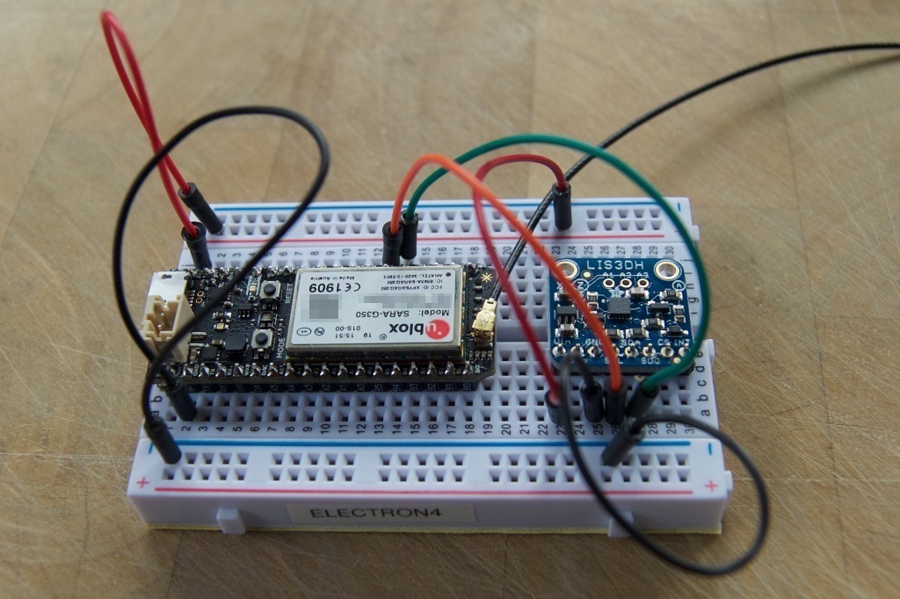
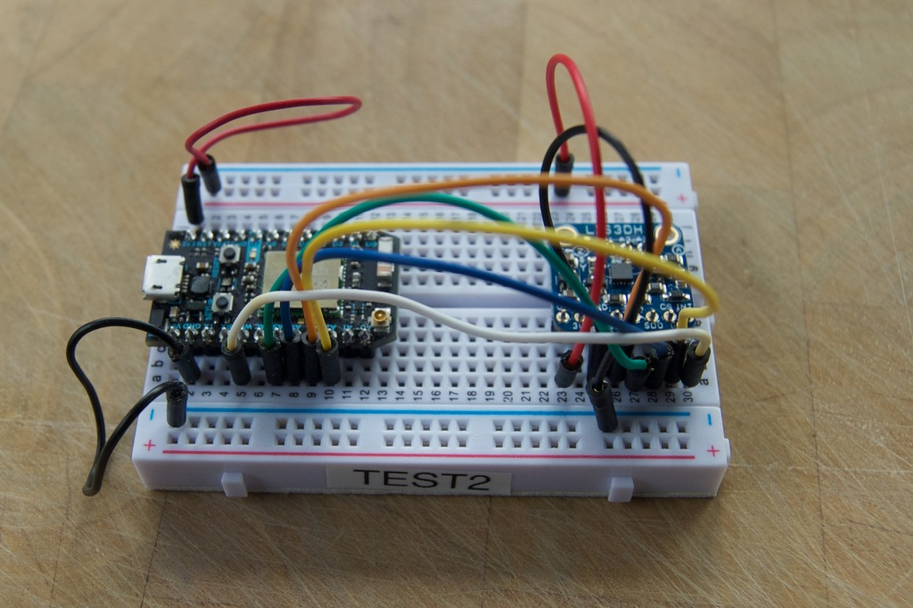

# LIS3DH
*LIS3DH Accelerometer driver for Particle*

This is a replacement LIS3DH accelerometer driver for the Particle Photon, P1, Electron and Core. It can use either the SPI interface or the I2C interface.

It works with the Particle AssetTracker and Electron without modification, and can also be used with an external LIS3DH device or breakout.

Official project location:
[https://github.com/rickkas7/LIS3DH](https://github.com/rickkas7/LIS3DH)

You may also find the [data sheet](http://www.st.com/resource/en/datasheet/lis3dh.pdf) and [application note](http://www.st.com/resource/en/application_note/cd00290365.pdf) handy when using this library.

## Connecting the LIS3DH

Of course you don't need to do this if you're using an AssetTracker, but if you're using an actual LIS3DH, you can connect it either with SPI or I2C.

The [Adafruit LIS3DH breakout](https://www.adafruit.com/products/2809) provides the following connections:

- VIN: 3.3V to 5V input, connect to 3V3
- 3VO: 3.3V output (100 mA), leave disconnected
- GND: Ground, connect to GND
- INT: Interrupt output, optionally connect to WKP
- A0: ADC input 0, leave disconnected
- A1: ADC input 1, leave disconnected
- A2: ADC input 2, leave disconnected

To use I2C mode:

- SCL: I2C SCL, connect to D1 (Wire) or C5 (Wire1, on Electron only)
- SDA: I2C SDA, connect to D0 (Wire) or C4 (Wire1, on Electron only)
- CS: Leave disconnected or connect to 3V3
- SDO: I2C address selection GND or NC = 0x18, HIGH = 0x19

To use SPI mode:

- SCL: SPI SCK, connect to A3 (SPI) or D4 (SPI1)
- SDA: SPI MOSI, connect to A5 (SPI) or D2 (SPI1)
- SDO: SPI MISO, connect to A4 (SPI) or D3 (SPI1)
- CS: SPI CS, connect to A2 (SPI) or D5 (SPI1)

If you're looking at my picture, I use the following color code, arbitrarily selected but I try to be consistent about it:

- Red: 3V3
- Black: GND
- Green: SPI MOSI or I2C SDA
- Blue: SPI MISO
- Orange: SPI SCK or I2C SCL
- Yellow: SPI CS
- White: Interrupt

If you're using the Electron, there are additional pins you can use for I2C and SPI on the B and C pins.

## Using the LIS3DH Driver

There are examples for I2C and SPI, depending on how the device is connected, but one you instantiate either the LIS3DHI2C or LIS3DHSPI object, they are used identically.

The example files show how to read actual accelerometer samples, using the position detection mode (determines when the accelerometer is in a stable position), using movement detection, and the wake-on-move feature.

## Revision History

#### 0.2.8 (2020-05-05)

- Fix compiler error for undefined conversion to SpiClass with 1.5.1-rc.1. The fix in 0.2.7 didn't work properly with SPI1.

#### 0.2.7 (2020-05-05)

- Fix compiler error for undefined conversion to SpiClass with 1.5.1-rc.1. 

#### 0.2.6

- Fix compiler error for ambiguous requestFrom with 1.5.0-rc.2. 

#### 0.2.5

- Remove call to SPI.begin() from LIS3DHSPI constructor to avoid SOS+1 fault on 1.5.0-rc.1 and later.

#### 0.2.4

- When calling setAccelMode, clear all of the settings that are set by setLowPowerWakeMode so you can switch 
between modes at runtime.

#### 0.2.3

- In getSample, check the STATUS register instead of the STATUS_AUX register.

